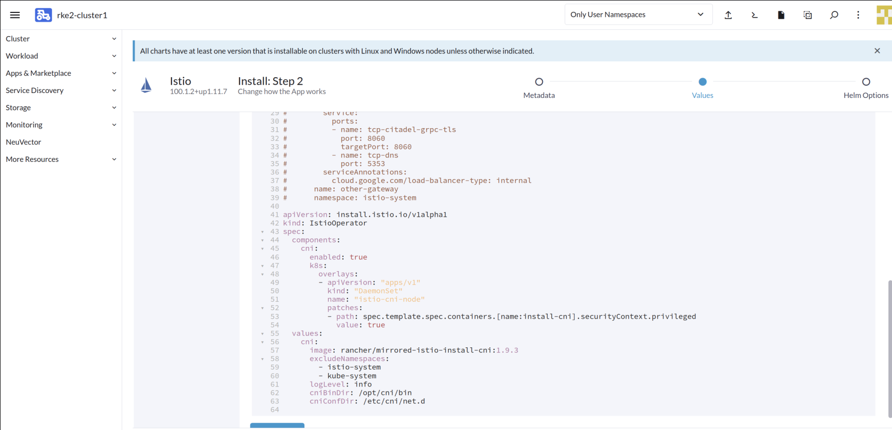
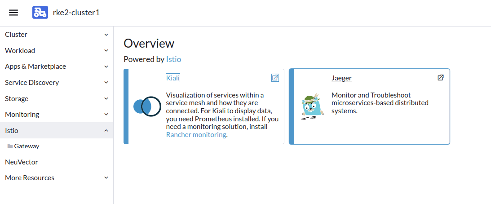

# Lab 1 - Setup Istio


## Step 1 - Access your Rancher Cluster

Access your Rancher Server using the URL & credentials provided (over email or other communication.....). Click on advance `Proceed to RancherIP.sslip.io`


You will be presented with Rancher Server Login Page. Enter the Rancher Credentials.


2. In Rancher Home page, click the `3-line` icon next to Rancher logo on the top left corner. Click on `Explore Cluster` > `Cluster Management`


Click on `Explore` button on the right hand for Cluster `rke2-cluster1`


You will be presented with `Cluster Dashboard` view for Cluster `rke2-cluster1`


## Step 2 - Enable monitoring on RKE2

Before installing Istio, you need to enable Monitoring (Prometheus and Grafana) in the cluster tool of RKE2 cluster.

Click on `Cluster Tools` at the bottom of the left hand side menu pane. 


Click `Install`  button of the `Monitoring` application.


Choose `System` in `Install Into Project` selection box, and then click `Next`.


Ideally you will leave the Prometheus values default, however for our lab since we are using 4 vCPU's let adjust our resource request as below

Resource Limits 

`Requested CPU = 250m`

`Requested Memory = 500Mi`

Rest all default


Once Prometheus is successfully installed, you should success message as below. 


Once Monitoring is installed, you will see the `Monitoring` as available left hand side menu pane. You can click on `Grafana` which will open browser window `Grafana Dashboard`


## Lab 3 - Setup Istio with Rancher

After Monitoring add-on is installed, navigate to the `Cluster Tools` page, this time choose `Istio` and click on `Install` button.


Choose `System` in `Install Into Project` selection box, and then click `Next`.


On the `components` tab, check the box next to `Enabled CNI` and ` Enable Jaeger Tracing` to select the appropriate Istio components. 


On the `Custom Overlay File` ta, add a custom overlay file like below to specify the path for `cniBinDir` and `cniConfDir`.

See Notes: https://rancher.com/docs/rancher/v2.6/en/istio/configuration-reference/rke2/

```yaml
apiVersion: install.istio.io/v1alpha1
kind: IstioOperator
spec:
  components:
    cni:
      enabled: true
      k8s:
        overlays:
        - apiVersion: "apps/v1"
          kind: "DaemonSet"
          name: "istio-cni-node"
          patches:
          - path: spec.template.spec.containers.[name:install-cni].securityContext.privileged
            value: true
  values:
    cni:
      image: rancher/mirrored-istio-install-cni:1.9.3
      excludeNamespaces:
        - istio-system
        - kube-system
      logLevel: info
      cniBinDir: /opt/cni/bin
      cniConfDir: /etc/cni/net.d
```

Your Custom Overlay file should look as below




Click `Install` button to start deploying Istio on RKE2 cluster.


On successfully install of Istio, you should see below success message.


You should now see `Istio` on left hand side menu pane & if you click on the drop down under Istio you should see `Kiali` and `Jaeger`



You can click on `Kiali` and `Jaeger` to look at thier respective dashboard


# 

## Step 4 - Open Grafana and check Istio monitoring

Click on `Monitoring` and click on `Grafana` . 

Under Grafana Dashboards, you will see various Istio Dashboard options to view (Istio ControlPlane Dashboard,  Istio Mesh Dashboard, Istio Performance Dashboard, Istio Service Dashboard, etc...... )


Next step is to enable Istio sidecare injection in the namespace where we would like to run our application. 

## Step 5 - Enable sidecar injection in default workload

Click `Istio` on the left pane menu and Click `Kiali`

Choose Default namespace, click `3 dots vertical line` and click on `Enable Auto Injection`


Upon success you move your mouse on `Labels` you will see the injection successfully done 


To summarize, we have successfully deployed Monitoring and Istio.

In the next exercise, we will deploy our micro-services application to take advantage of Istio. 
