# Lab 2 - Deploy Sample BookInfo Microservices

With Istio (Service Mesh) and Prometheus/Grafana (Monitoring) components deployed on the RKE2, let's deploy a sample microservices-based application on to the `default` namespace of this cluster.


## Step 1 - Enable Auto-injection in default namespace

Before we deploy microservices app into default namespace, we need to make sure Istio can automatically inject an envoy proxy sidecar sitting next to teach cicroservices. To achieve this, we need to enable auto-injection.

1. Navigate to `Istio` on the left pane menu.

2. Choose `Kiali` application
3. You will be presented a home page 


## Step 2 - Deploy the microservices application

From the Rancher server, navigate to the cluster "rke2-cluster"

At the cluster dashboard view, go to the option "Import Yaml" at the top right hand corner.

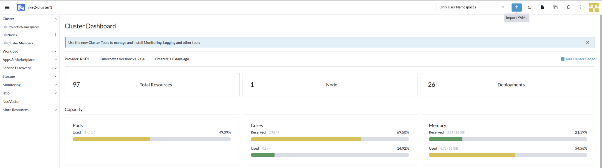

Open a browser tab, navigate to this URL: https://github.com/istio/istio/blob/master/samples/bookinfo/platform/kube/bookinfo.yaml

Copy the content into Rancher import yaml dialog window.
Ensure that "default" is being selected as the "Default Namespace". Click on "Import" to start the deployment.

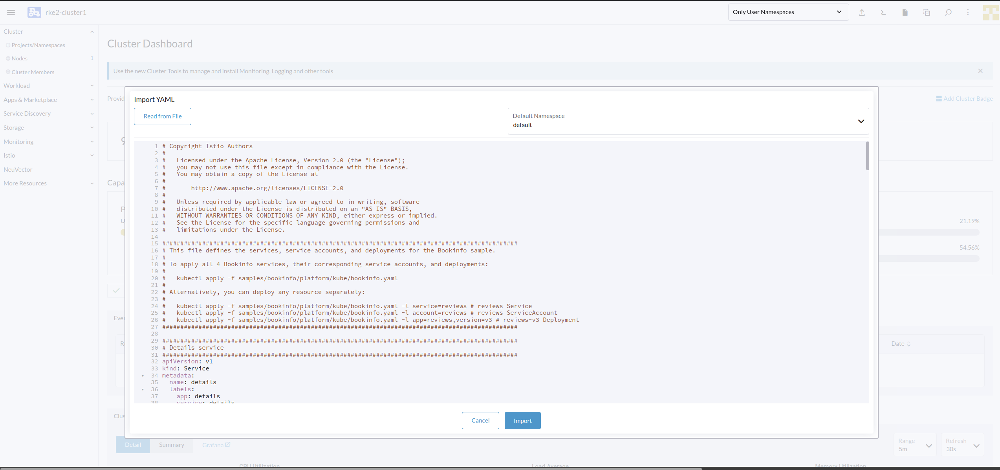

This will create various Kubernetes Objects as decribed in the the deployment yaml for BookInfo Application. You can see deployment is updating which indicates container are getting provisioned. Within 1 mins you should be able to the see the deployment rollout successfully. 

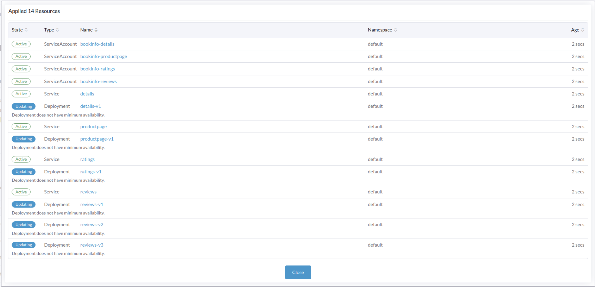

`Cluster` > `Workload` > `Deployments`  select appropriate namespace `default`

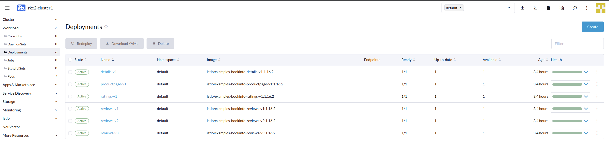

`Cluster` > `Workload` > `Pods`  select appropriate namespace `default`

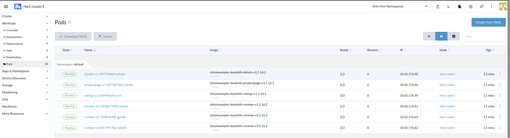

`Cluster` > `Workload`  `Services` > select appropriate namespace `default`

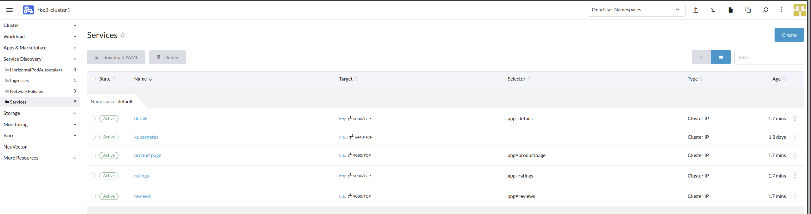


## Step 2 - Deploy Istio gateway for BookInfo app

In the previous step, we were looking at the Service for the application which would be typically taking advantage of Ingress Controller to expose as Service, however we are using Istio. Istio uses it's own Load Balancer to route the Istio traffic. 

For the application to take advantage of Istio, we will need to create an Istio Gateways Service for our BookInfo Application. 

Navigate to Rancher rke2-cluster (Cluster) 

`Cluster` > Cluster Dashboard`> Import YAML`  


Navigation to this URL: https://github.com/istio/istio/blob/master/samples/bookinfo/networking/bookinfo-gateway.yaml

Copy the content into Rancher import yaml dialog window.

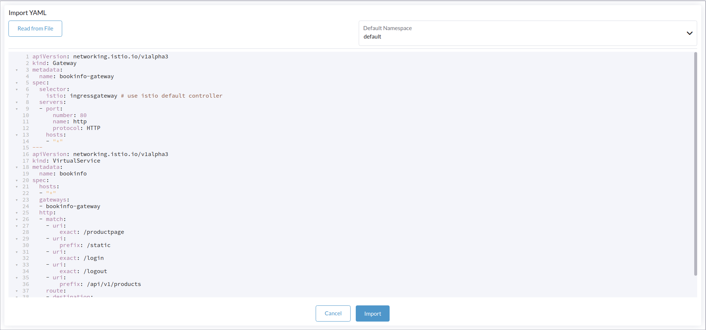

`Cluster` > `Istio` >  `Gateways` 

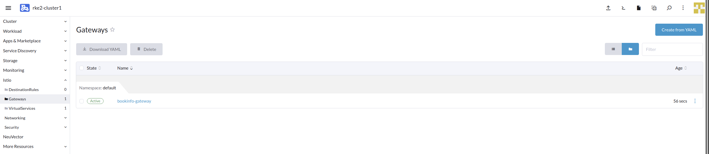


The gateway URL = http://<public ip from neuvector>:<http2 port>

## Step 3 - Find the BookInfo Gateway URL

We now have our Gateway Services for Istio set-up. We now need to utilze it. 

Let's find out the URL for our Gateway Services. 

`Cluster Explorer` > `Services` > switch to `Isito-system namespace`

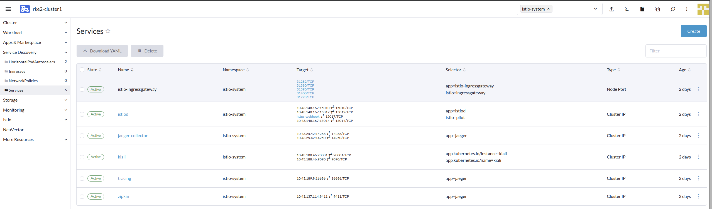

Click on the Name `istio-ingressgateway` and take a note of the `NodePort` as we will need it. As sample my `NodePort` value is `31380`

You will have your own respective `NodePort` so make a note of the port. The value will be used in next step. 

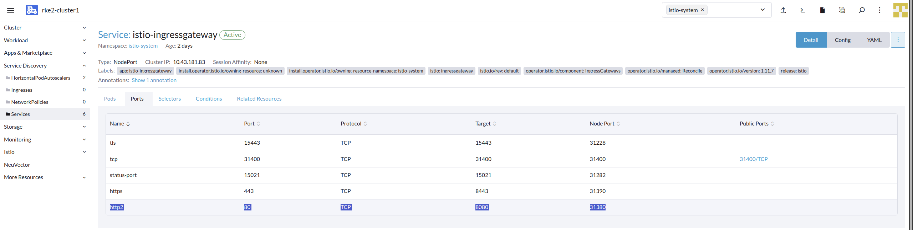

Next things is will will need the Public IP of your RKE2 downstream cluster.  

The IP has been already shared with you.  Look for `neuvector_webui_url` . Append the `Nodeport` & `productpage`. URL should look like below. 

URL = http://<public ip from neuvector>:<Nodeport>/productpage. 

`http://40.80.87.0:31380/productpage`

Sample output below

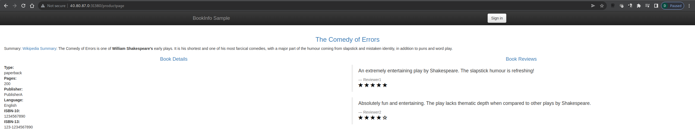

Congratulation! you have successfully deployed the BookInfo App. 


## Step 4 - Deploy destination rules

In this steps, we are setting up some destination rule which will allow traffic between the various pod used by Bookinfo app. 

Navigate to Rancher rke2-cluster (Cluster) 

`Cluster` > Cluster Dashboard`> Import YAML`  

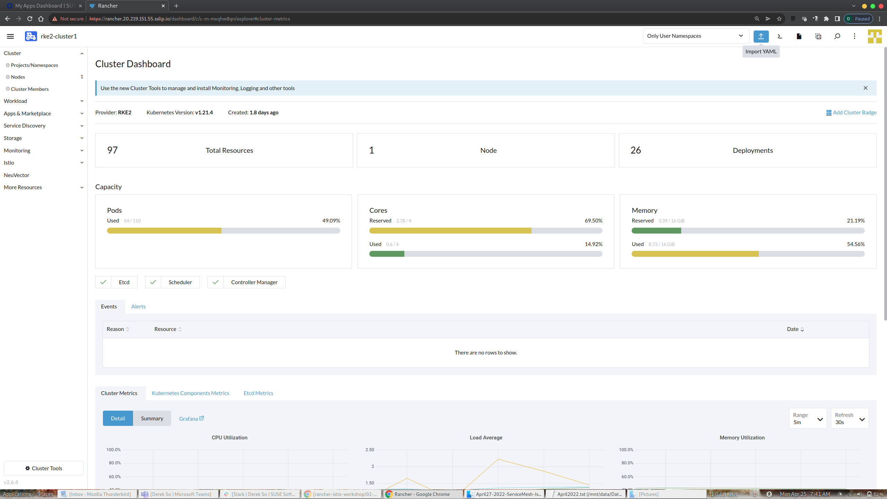

Navigate to this url: https://github.com/istio/istio/blob/master/samples/bookinfo/networking/destination-rule-all.yaml

copy the content into Rancher import yaml dialog window and hit `Import`

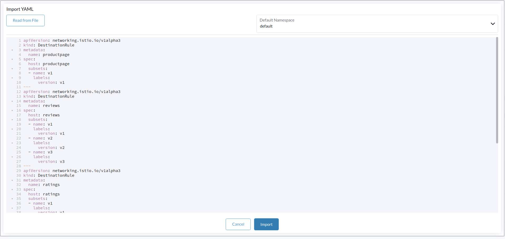

Destination Rule created, you can hit `close`

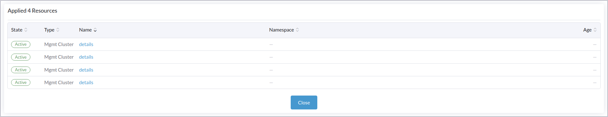

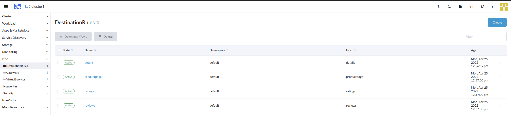

We have successfully deployed the destination rule.

Next step is to generate traffic to the bookinfo app. For this we will deploy a pod which will communicate every 1 second to the bookinfo app.

## Step 5 - deploy traffic generation app

For simplicity sake, we will deploy a simple pod which will curl into bookinfo app. The pod will be created in it's own namespace, so let first create the namespace. 

`Cluster` > `Project/Namespaces` > `Create Project`

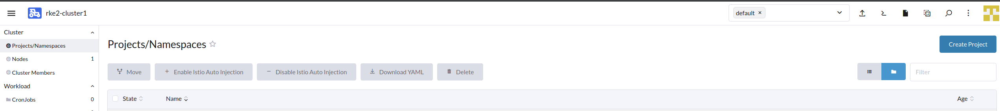

Project Name `loadtest`

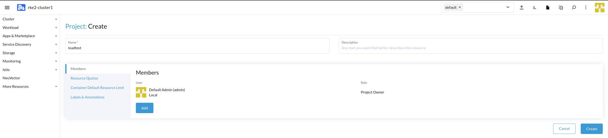

At the bottom of the page we see the Project `loadtest` created succesfully

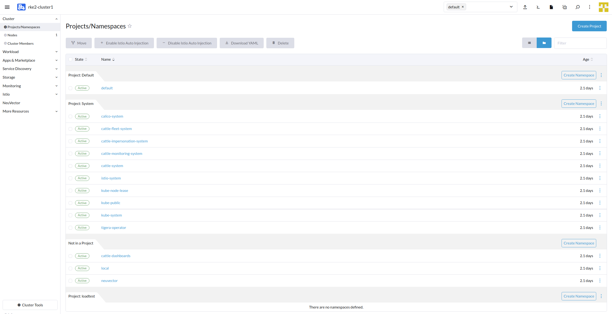

Name step is to create namespace with the project. Click on `Create Namespace`

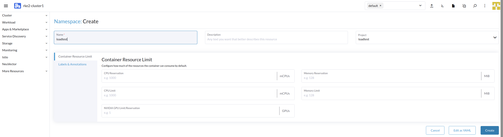

Namespace `loadtest` created successfully

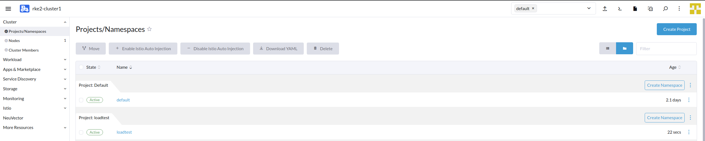

We are now ready to create the pod which will communicate with bookinfo app. 

Navigate to Rancher rke2-cluster (Cluster) 

`Cluster` > Cluster Dashboard`> Import YAML`  


Create namespace `loadtest` under Default project in rancher

Import this yaml into Rancher

Copy the below mention yaml specificiation. 

Sample yaml definition. 

```
apiVersion: v1
kind: Pod
metadata:
  name: traffic-generator
  namespace: loadtest
spec:
  containers:
  - command: ['sh', '-c', 'while true; do sleep $INTERVAL; curl -sk $URL; done']
    env:
    - name: URL
      value: "http://20.219.17.7:31380/productpage"
    - name: INTERVAL
      value: "1"
    image: radial/busyboxplus:curl
    name: curl
```

**Important fields** in the yaml definition 

1 - **Namespace** `loadtest`

2 - **URL** `http://40.80.87.0:31380/productpage`. URL should be within the quotes symbol `" "`

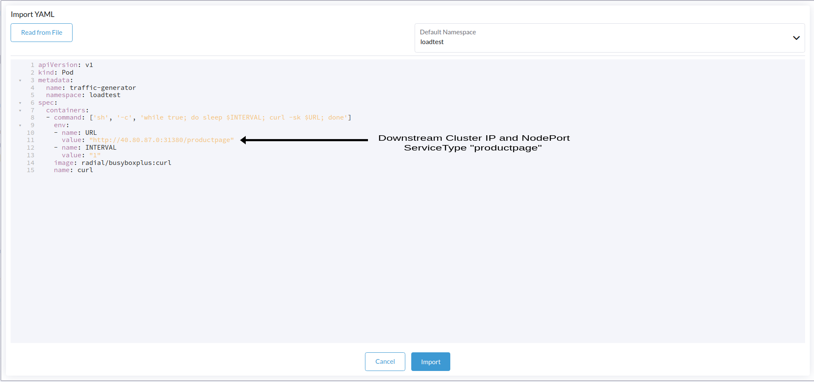

Let's check if the pod is up & running

`Cluster` > `Workload` > `Pod` > Under Namespace select `loadtest` 

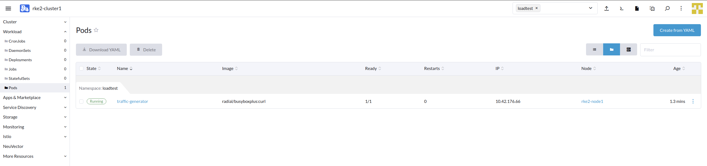

With this we have successfully completed step 2 of the workshop.  

To summarize, we have deployed the micro-services, enabled Istio, injected Istio sidecars to our application, configured Istio Gateway & destination rule to access application and it's application traffic. Finally we have deployed a container to access the application. 

In the next steps, we will observe the application traffic via Kiali & Jaeger. 
