# Lab 3 - Visualize Your Service Mesh

Once you have deployed the microservices app into `default` namespace and the traffic generator has been running to constantly visiting the application endpoint, we can make use of Kiali to visualize your service mesh. 

To access Kiali, 

`Cluster` > `Istio` > `Kaili`

We have only configured Istio on namespace `default`, hence this will be the only namespace that you will see a green tick besides `Istio Config`

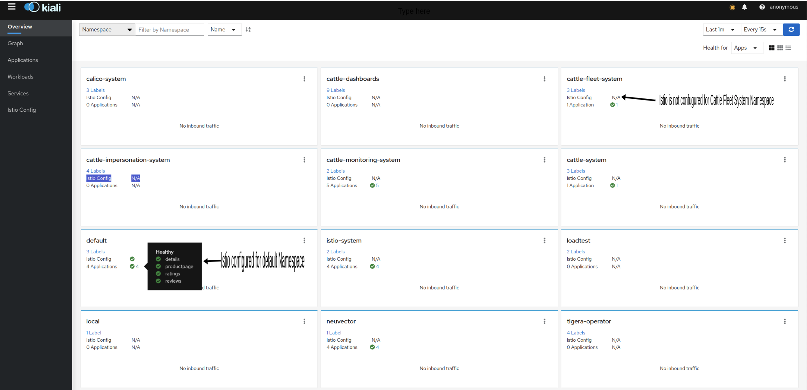

Click on 3 Vertial dots in the namespace `default` and then select `graph`

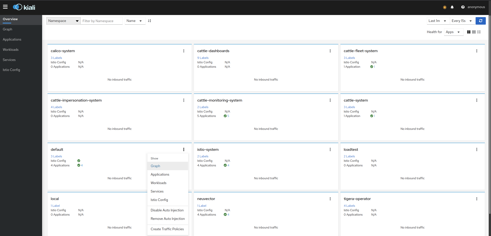

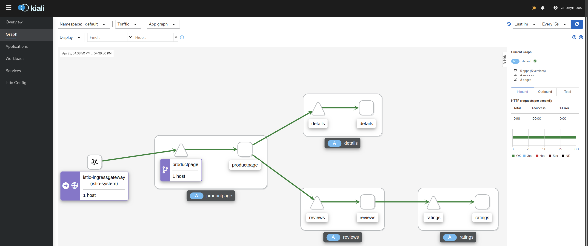

Click on `Display` and you can tick the check boxes to play around the graphics.

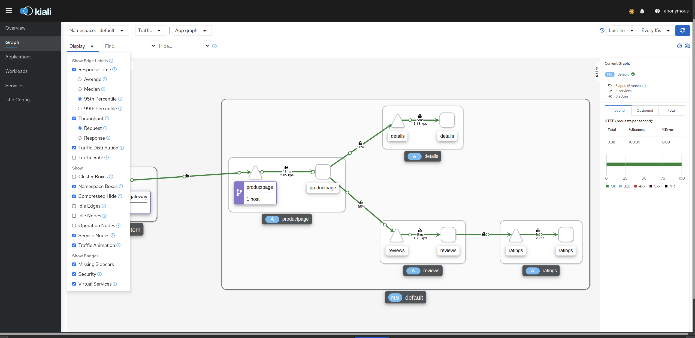

You can also check out `Istio Legends`

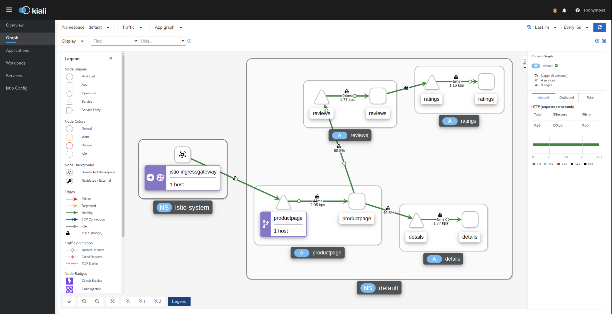

By taking note of the `legends`, it is easier to see how your traffic is flowing between various components.

 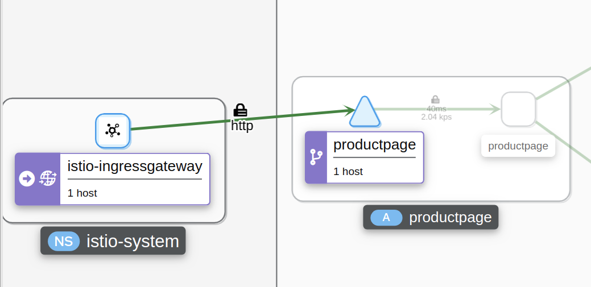

For example, on the screenshot below, we can see the traffic between productpage Service & productpage Application. We can also tell this is a `http` traffic with 2.04 kps speed between the

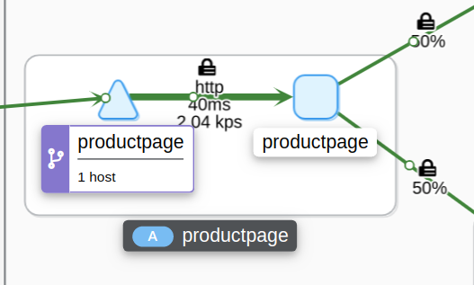

Next we can also see the traffic `productpage` to `reviews`. We can tell that the communication between the microservice is secured as it has been encrpyted.

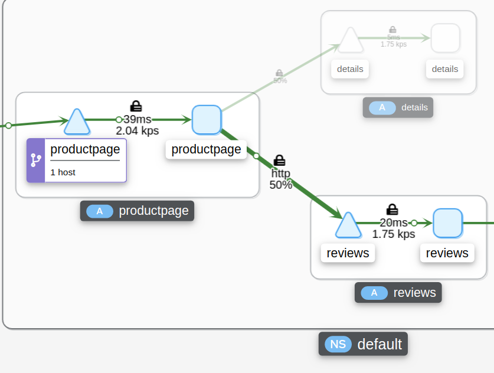

The screenshot below shows the communication between `reviews` to `rating`.

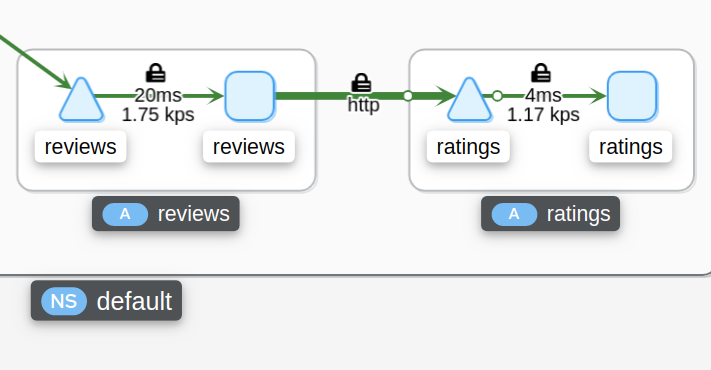

You can also toggle between 3 topologies to change the layout visualization.

`Default Layout`

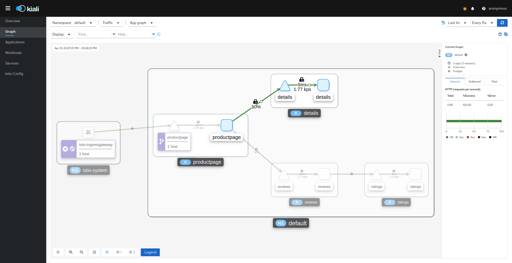

Layout -1 - cose-bilkent

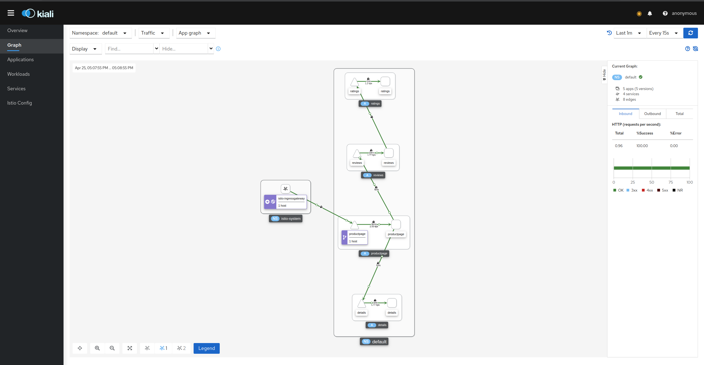

Layout 2 - Cola 

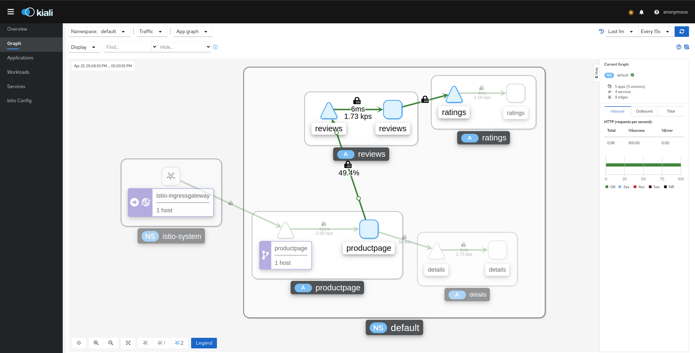

You can change the traffic metric refresh rate by adjusting the value of your choice.

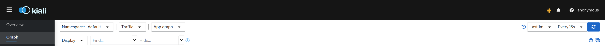

New value

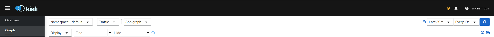

Application Page 

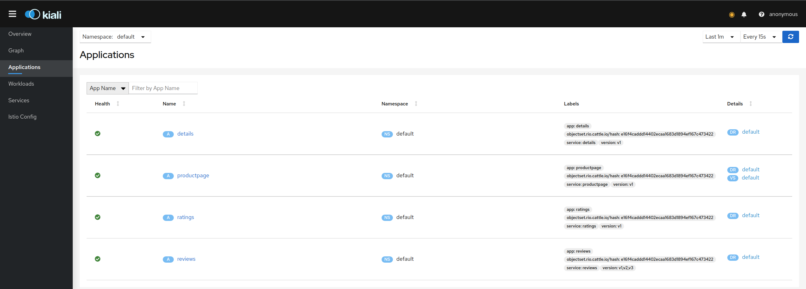

If you click on `productpage` under `Name` column you will see the traffic flow. 

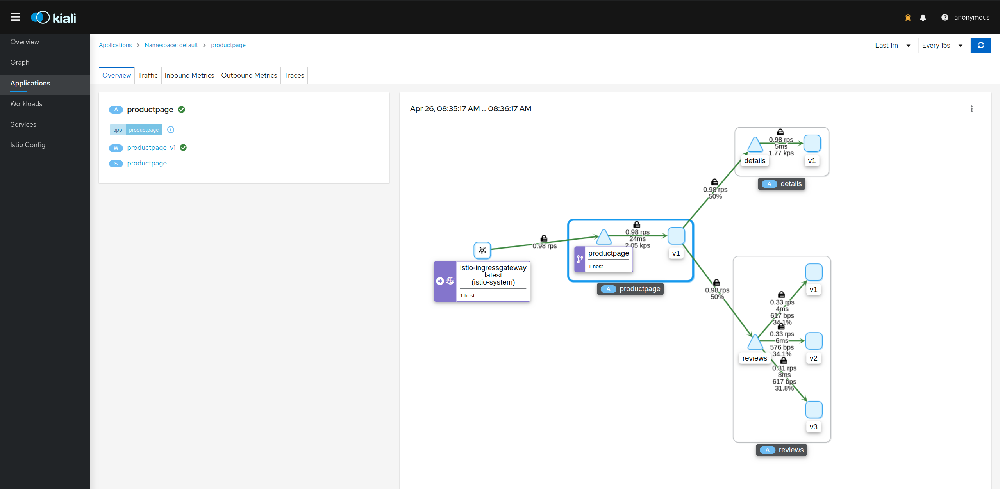

Under `Workload` if you click on `ratings-v1`,

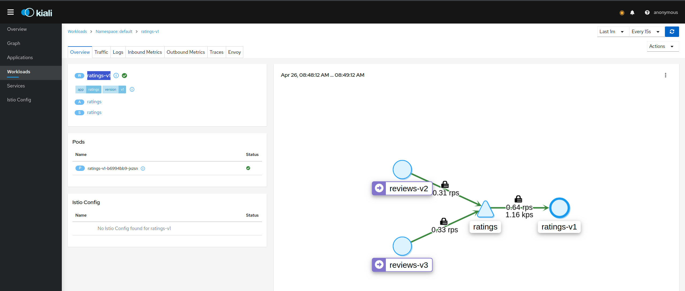

Similarly Under `Service` Tab if you click on `productpage` under `Name` column you will see the Service flow. 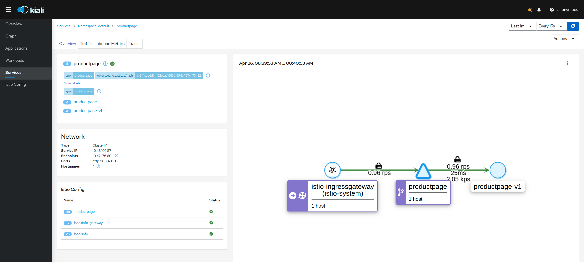

Finally, under `Istio Config` tab you will see all Istio component that you can view & configure. 

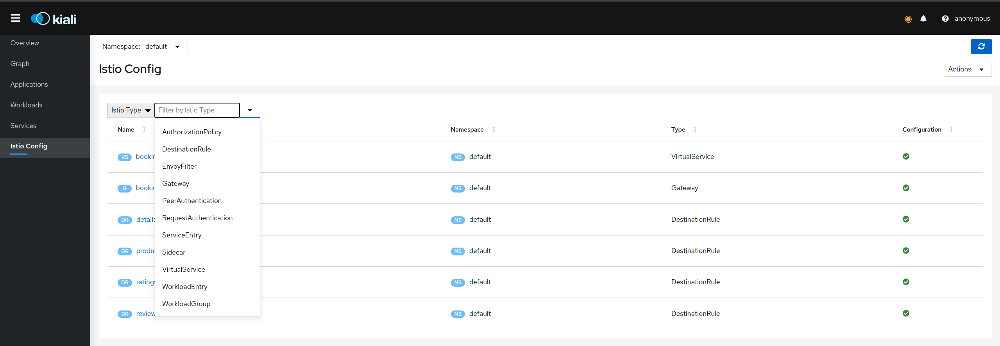

To summarize, we have viewed how our application traffic is going from Istio Ingress gateway to various microservices.

