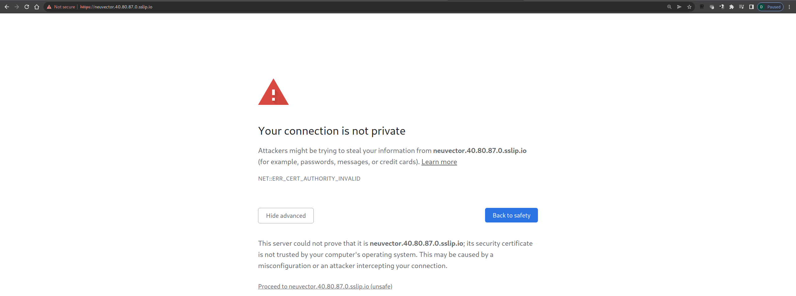
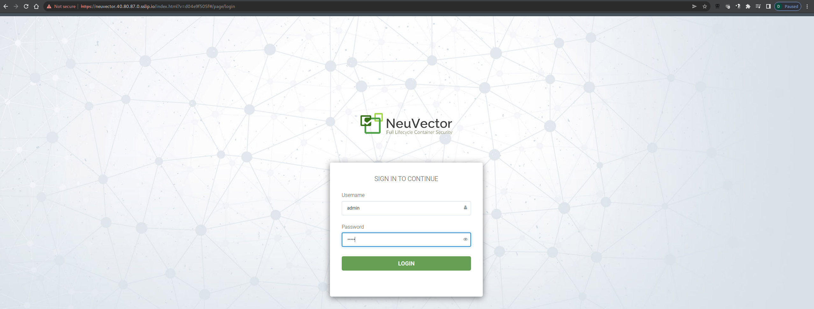
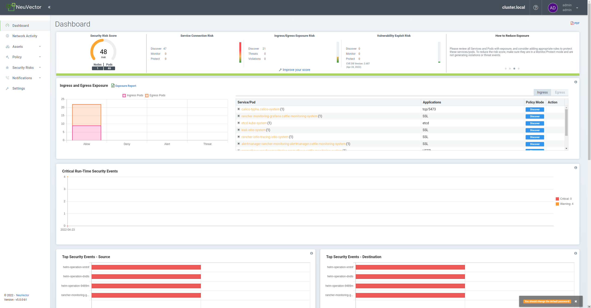
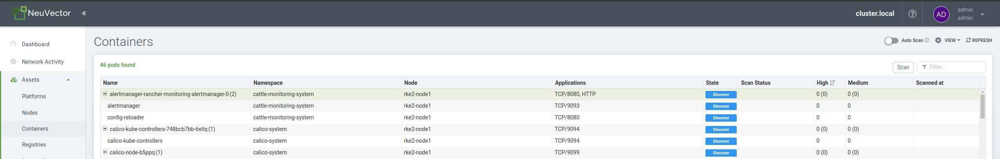
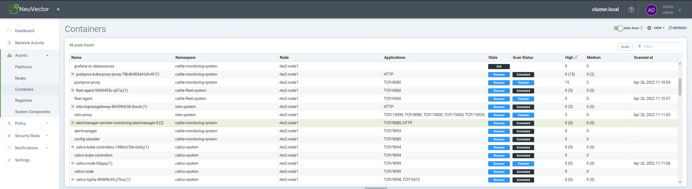
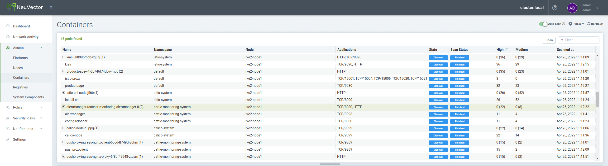
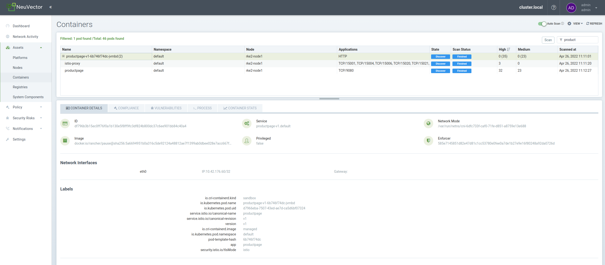
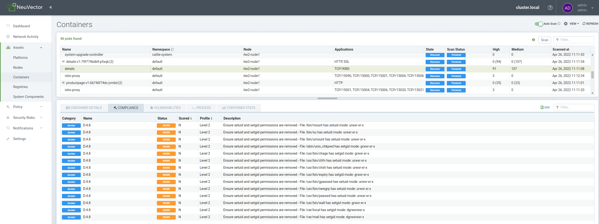
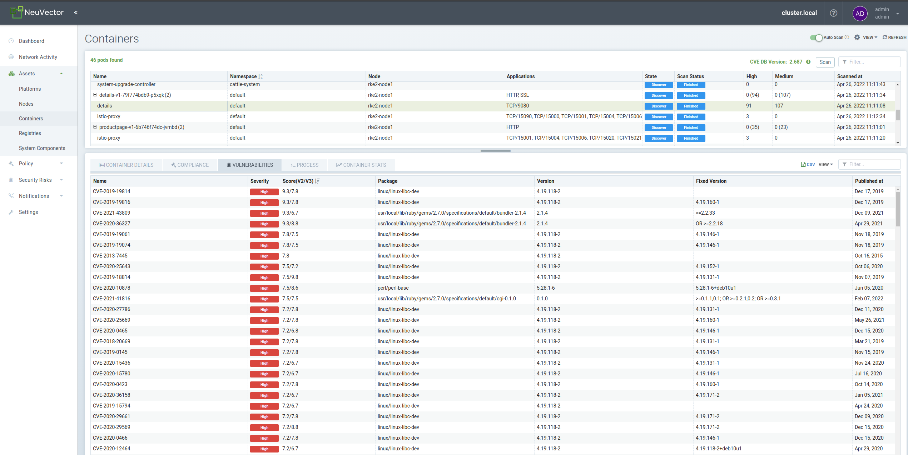

# Explore Neuvector

Access your Neuvector Server using the URL & credentials provided (over email or other communication.....).

Click on advance `Proceed to NeuvectorIP.sslip.io`

Upon clicking on proceed to Neuvector, you will routed to Neuvector Login page. Provide your Neuvector Credential. 

Accept the `End User License agreement` to proceed to Neuvector Homepage. 

You get a good high level overview of 

1. `Security Risk Score` for `Nodes & Pods`
2. `Service Connection Risk`. 
   - 3 different modes. 1) `Discover` , 2) `Monitor` and 3) `Protect`
3. `Ingress/Egress Exposure Risk` 
   -  3 different modes. 1) `Discover` , 2) `Monitor` and 3) `Protect`
4. `Vulnerability Exploit Risk`
   -  3 different modes. 1) `Discover` , 2) `Monitor` and 3) `Protect`

 

## Container Vulnerability Scanning

When we deploy containers, we need to make sure we have acceptable level to image vulnerability so that it can be put to production. 

`Asset`  > `Containers`  >  `Auto-Scan`

Upon turning `Auto Scan`  `= ` `on`you shall see the scan status `scheduled`

You can easily filter pod with their name to narrow you investigation. You can click on different tab such as `Compliance`, `Vulnerabilities`, `Process` and finally `Container Stats`

Sample of Compliance for details Containers  

Sample Vulnerabilities for details Container

## Visualize Network Activity in Learning Mode

Match Rules: default namespace only

Hidden Namespace: 
- cattle-monitoring-system
- cattle-fleet-system
- cattle-system
- calico-system

