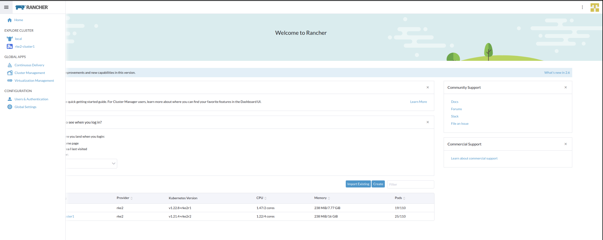
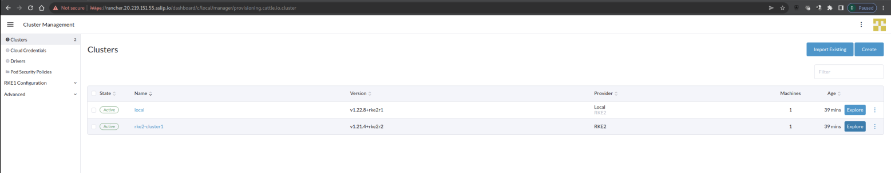
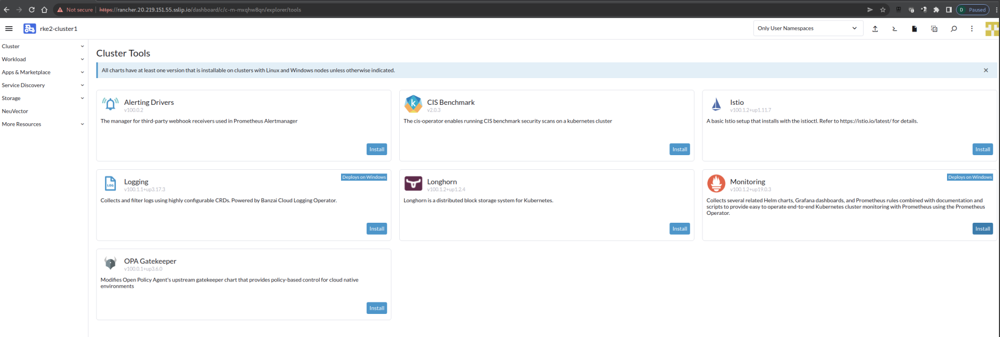
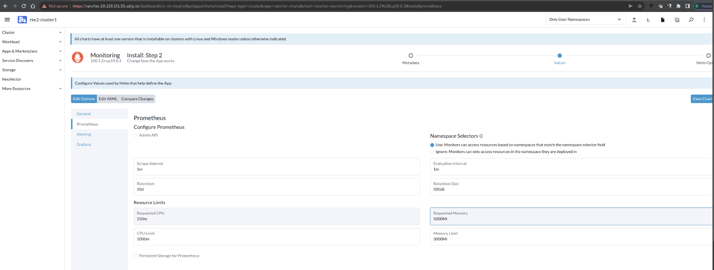
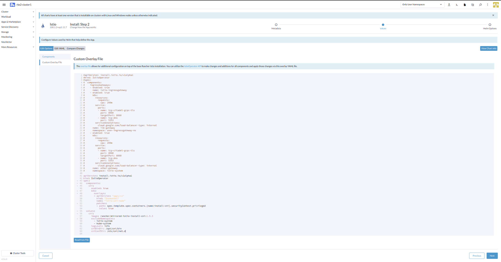
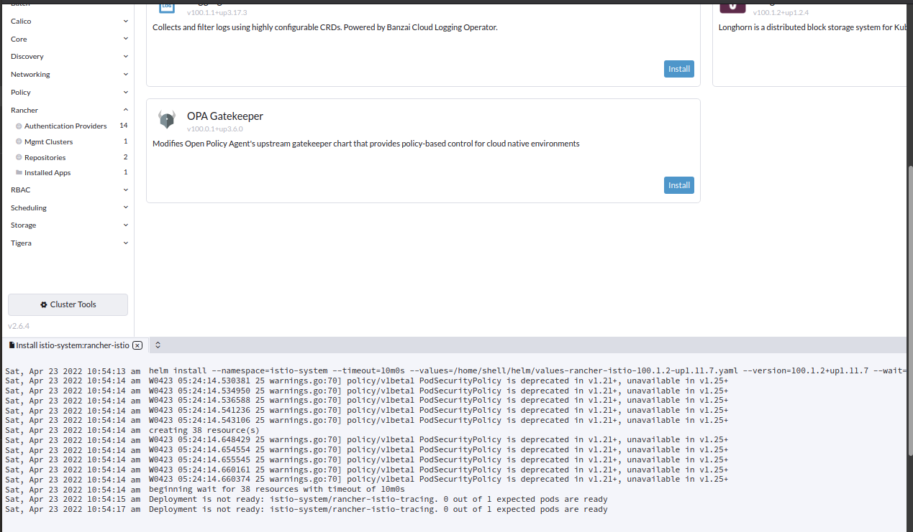

# Lab 1 - Deploy Monitoring and Istio onto RKE2 cluster

In this exercise, we are going to enable detailed monitoring and service mesh capabilities on a RKE2 cluster. This is very simple with Rancher's cluster tools. It should take about 5 minutes to complete. Let's dive in now.


## Before We Begin

Before we start the lab, please make sure you have been provided with the following lab access credentials from the instructor. Each participant should have their own unique environment and credentials.

| Item                              | Value                                  |
| --------------------------------- | -------------------------------------- |
| Rancher Server URL                | https://rancher.xx.xx.xx.xx.sslip.io   |
| Rancher Server Username           | admin                                  |
| Rancher Server Bootstrap Password | (system assigned strong password)      |
| Neuvector URL                     | https://neuvector.yy.yy.yy.yy.sslip.io |
| Neuvector Username                | admin                                  |
| Neuvector Password                | admin                                  |


## Step 1 - Access your RKE2 Cluster via Rancher

With a Google Chrome browser, navigate to the Rancher Server URL (https://rancher.xx.xx.xx.xx.sslip.io). You will then be shown an invalid SSL certificate error message. There are 2 ways to by pass this error, you can choose to (1) type the word `this is unsafe` on this page to bypass the warning message, or (2) you can also click on the **Advanced** button and click the Proceed to https://rancher.xx.xx.xx.xx.sslip.io hyperlink to continue. 

You will then be led to Rancher Server login page. Enter the admin credentials to login. When it's successful, you will be landing on the Rancher Home page. 


In Rancher Home page, click the `3-line` icon next to Rancher logo on the top left corner. 

Click on `Global Apps` > `Cluster Management`



Click on `Explore` button on the right hand for Cluster `rke2-cluster1`



You will then be presented with `Cluster Dashboard` view for Cluster `rke2-cluster1`


## Step 2 - Enable monitoring on RKE2

Before installing Istio, you need to enable Monitoring (Prometheus and Grafana) in the cluster tool of RKE2 cluster.

Click on `Cluster Tools` at the bottom of the left hand side menu pane. 


Click `Install`  button of the `Monitoring` application.



Choose `System` in `Install Into Project` selection box, and then click `Next`.


Ideally you will leave the Prometheus values as default, however for our lab we need to adjust our resource request as below

Resource Limits 

* `Requested CPU = 250m`

* `Requested Memory = 500Mi`

You can leave the rest of the options as default. Click on the "Install" button to continue.



Once Prometheus is successfully installed, you should success message as below. 


Once Monitoring is installed, you will click on the newly available `Monitoring` option on the left hand side menu pane. You can then click on `Grafana` which will open browser window `Grafana Dashboard`


## Step 3 - Setup Istio with Rancher

After Monitoring add-on is installed, navigate to the `Cluster Tools` page, look out for `Istio` and click on its `Install` button.


Choose `System` in `Install Into Project` selection box, and then click `Next`.


On the `components` tab, check the box next to `Enabled CNI` and ` Enable Jaeger Tracing` to select the appropriate Istio components. 
You can leave the rest of the options as default.


On the `Custom Overlay File` tab, add a custom overlay file as shown below to specify the path for `cniBinDir` and `cniConfDir`.
You can append the contents of the yaml file to the default configuration shown on the tab.

See Notes: https://rancher.com/docs/rancher/v2.6/en/istio/configuration-reference/rke2/

```yaml
apiVersion: install.istio.io/v1alpha1
kind: IstioOperator
spec:
  components:
    cni:
      enabled: true
      k8s:
        overlays:
        - apiVersion: "apps/v1"
          kind: "DaemonSet"
          name: "istio-cni-node"
          patches:
          - path: spec.template.spec.containers.[name:install-cni].securityContext.privileged
            value: true
  values:
    cni:
      image: rancher/mirrored-istio-install-cni:1.9.3
      excludeNamespaces:
        - istio-system
        - kube-system
      logLevel: info
      cniBinDir: /opt/cni/bin
      cniConfDir: /etc/cni/net.d
```

Your Custom Overlay file should look as below




Click `Install` button to start deploying Istio on RKE2 cluster.



On successfully install of Istio, you should see below success message.


With this, you should now have both Istio and Monitoring apear as left side menu pane. 

We are ready to move to the **Exercise 2: [02-deploy-microservices.md](https://github.com/dsohk/rancher-istio-workshop/blob/main/docs/02-deploy-microservices.md)**
