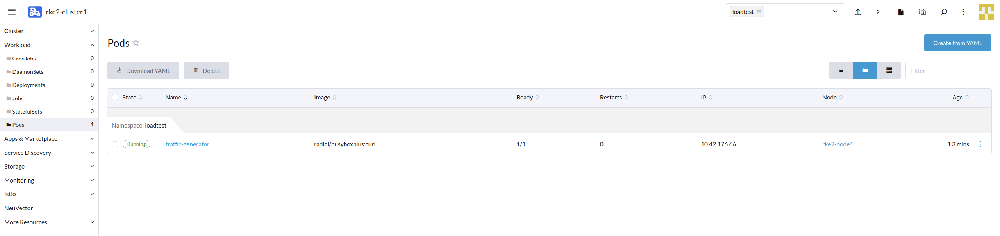

# Lab 2 - Deploy Sample BookInfo Microservices

With Istio (Service Mesh) and Prometheus/Grafana (Monitoring) components deployed on the RKE2, let's deploy a sample microservices-based application on to the `default` namespace of this cluster.


## Step 1 - Enable Auto-injection in default namespace

Before we deploy microservices app into default namespace, we need to make sure Istio can automatically inject an envoy proxy sidecar sitting next to teach cicroservices. To achieve this, we need to enable auto-injection.

Click `Istio` on the left pane menu and Click `Kiali`

Choose Default namespace, click `3 dots vertical line` and click on `Enable Auto Injection`


Upon success you move your mouse on `Labels` you will see the injection successfully done 


Alternatively, you can also enable Auto Injection via Rancher UI - Cluster Dashboard 

`Cluster Dashboard` >  `Cluster` > `Project/Namespace`  > `3 Vertical Dots` against the selected Namespace & click on `+ Enable Istio Auto Injection`


## Step 2 - Deploy the microservices application called BookInfo


`Cluster` > `Apps & Marketplace` > `Charts` > `rancher-rodeo` > `bookinfo` 

Select Namespace **bookinfo**, provide a name to your application and click `Next`  


Continue with default and hit `Install` 

Upon successfull deployment of the application, we should see **success**


You can verify your deployment, pods & services  under namespace `bookinfo` 

Cluster > Workload > Deployment 

Cluster > Workload > Pods

Cluster > Service Discovery > Services

Under Istio, you can view the Destination Rule, Gateway & Virtual Services created 

Cluster > Istio > Destination Rules

Cluster > Istio > Gateway

Cluster > Istio > Virtual Services

## Step 3 - Expose BookInfo Application to Users 

Now that we have our application deployment, let expose our application by creating an Ingress Service.

`Cluster` > `Service Discovery` > `Ingress`  > `Create`

Fill the below detail in the `Ingress` Page

`namespace` = `istio-system`

`name` = `bookinfo`

Under `Rules` Page 

 `Request Host`  `=`  `bookinfo.<IP-of-NeuVector>.sslip.io`

`Path` = `ImplementationSpecific`

`Target Service` = `Istio-ingressgateway`  

`Port` = `80`

Note **Please use your own unique IP of NeuVector Server**


We now have our Ingress Service for our bookinfo application created. 


To access the application, click on the URL under `Target`column. 

The page should error out (404 Page not found). This is expected, as our our application landing page is `ProductPage`.  Add `/productpage` at the end of the URL and this should bring up our application. Sample below.  


------------------------------------------------------------------------------------------------------------------------------------------------------------------------------------------------------------------

## Step 4 - Deploy traffic generation app

Cluster > `Import Yaml` at the top right hand corner. 


Copy the contents of the sample yaml definition below into Rancher import yaml dialog window.

**IMPORTANT: You must ensure that the value of URL is modified according to the one that you have taken down in STEP 5.
This URL must be within the quotes symbol `" "`**

Ensure that `loadtest` is being selected as the `Default Namespace`. Click on `Import` to start the deployment.

`Sample yaml definition` 

```
apiVersion: v1
kind: Pod
metadata:
  name: traffic-generator
  namespace: loadtest
spec:
  containers:
  - command: ['sh', '-c', 'while true; do sleep $INTERVAL; curl -sk $URL; done']
    env:
    - name: URL
      value: "http://20.219.17.7:31380/productpage"
    - name: INTERVAL
      value: "1"
    image: radial/busyboxplus:curl
    name: curl
```


Let's check if the pod is up and running by going to `Workload` > `Pods`. You might need to select the namespace `loadtest`.



With this we have successfully completed step 2 of the workshop.  

To summarize, we have deployed the micro-services, enabled Istio, injected Istio sidecars to our application, configured Istio Gateway & destination rule to access application and it's application traffic. Finally we have deployed a container to access the application. 

In the next steps, we will observe the application traffic via Kiali & Jaeger. 

We are ready to move to the [Exercise-03-Traffic Shaping with Service Mesh (Canary Deployment)](https://github.com/dsohk/rancher-istio-workshop/blob/main/docs/Exercise-03-Traffic Shaping-with-ServiceMesh.md)
