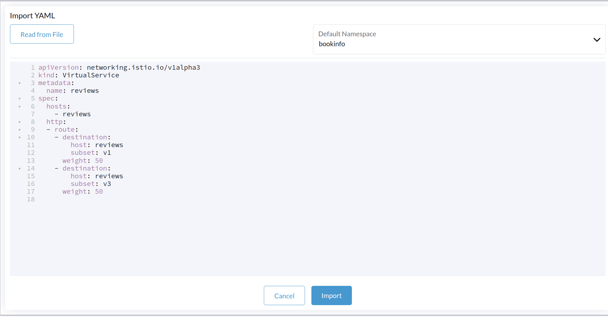

# Lab 03 - Traffic Shaping with Service Mesh

This exercise, we will configure shift traffic from one version of a microservice to another.

A common use case is to migrate traffic gradually from an older version of a microservice to a new one. 

In Istio, you can configure routing rules so that we re-direct a % of traffic to one destination to another. 

## Task 1 - We will route all traffic to v1 of each micro services

In this task, you will use send 100% of traffic to `reviews:v1` 

Cluster > Istio > Virtual Services > Import YAML > Read from File/Copy the yaml content

`route-all-traffic-to-v1.yaml`

Select appropriate namespace, `bookinfo` & hit `Import`

Notice that the reviews part of the page displays with no rating stars, no matter how many times you refresh. This is because you configured Istio to route all traffic for the reviews service to the version `reviews:v1` and this version of the service does not access the star ratings service.

## Task 2 - Let's transfer 50% of the traffic from `reviews:v1` to `reviews:v3`

Cluster > Istio > Virtual Services > Import YAML > Read from File/Copy the yaml content

`transfer-50%-traffic-to-reviews-v1-&-50%-to-reviews-v3.yaml`

Select appropriate namespace, `bookinfo` & hit `Import`

Refresh the /productpage in your browser and you now see red colored star ratings approximately 50% of the time. This is because the v3 version of reviews accesses the star ratings service, but the v1 version does not.

## Task3 - Let's transfer 100% of the traffic from `reviews:v3`

Assuming you decide that the `reviews:v3` microservice is stable, you can route 100% of the traffic to `reviews:v3` by applying this virtual service:

Cluster > Istio > Virtual Services > Import YAML > Read from File/Copy the yaml content

`reviews-only-v3`

Select appropriate namespace, `bookinfo` & hit `Import

Now when you refresh the `/productpage` you will always see book reviews with *red* colored star ratings for each review.
