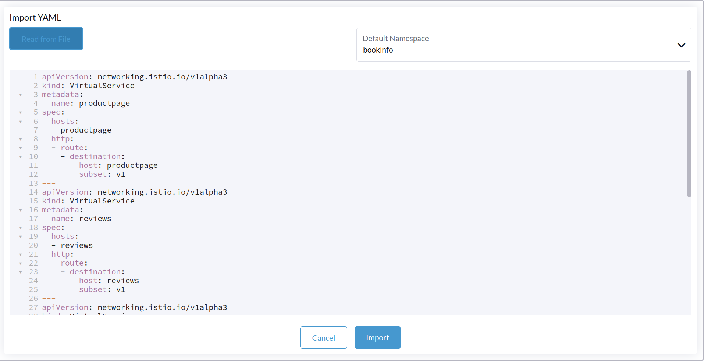
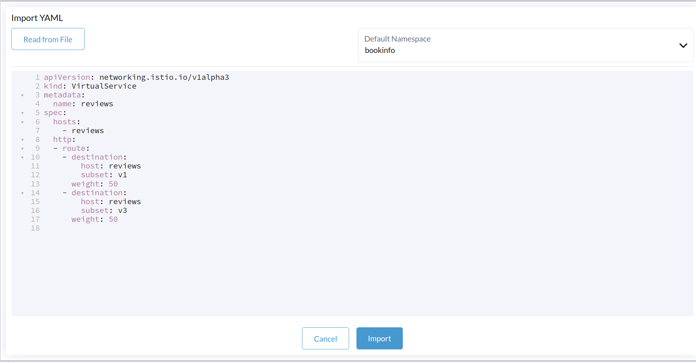
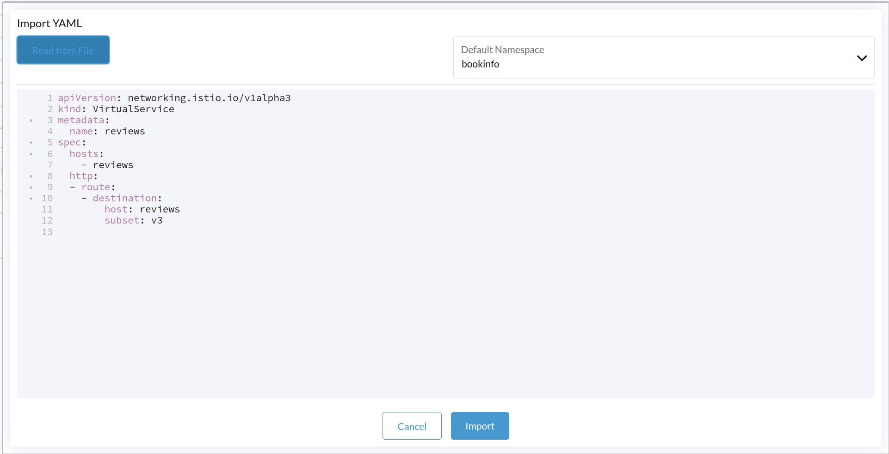

# Lab 03 - Traffic Shaping with Service Mesh

This this exercise, we will configure Virtual Service to shift traffic from one version of a micro-service to another.

A common use case is to migrate traffic gradually from an older version of a micro-service to a new one. In Istio, you accomplish this goal by configuring a sequence of routing rules that redirect a percentage of traffic from one destination to another.

## Task 1 - We will route all traffic to v1 of each micro services

In this task, you will use send 100% of traffic to **reviews:v1** , ***reviews:v1 part of the page displays with no rating stars***

Cluster > Istio > Virtual Services > Import YAML > Read from File/Copy the yaml content

`route-all-traffic-to-v1.yaml`

Select appropriate namespace, `bookinfo` & hit `Import`

Refresh the /productpage in your browser,  notice that the reviews part of the page displays with no rating stars, no matter how many times you refresh. This is because you configured Istio to route all traffic for the reviews service to the version `reviews:v1` and this version of the service does not access the star ratings service.

## Task 2 - Let's transfer 50% of the traffic from `reviews:v1` to `reviews:v3`

In this task, you will send 50% of traffic to **reviews:v1**  & **reviews:v3** respectively*. ***reviews:v3 part of the page displays red color stars***

Cluster > Istio > Virtual Services > Import YAML > Read from File/Copy the yaml content

`transfer-50%-traffic-to-reviews-v1-&-50%-to-reviews-v3.yaml`

Select appropriate namespace, `bookinfo` & hit `Import`

Refresh the /productpage in your browser and you now see red colored star ratings approximately 50% of the time. This is because the v3 version of reviews accesses the star ratings service, but the v1 version does not

## Task3 - Let's transfer 100% of the traffic from `reviews:v3`

In this task, you will send 100% of traffic to **reviews:v3**. ***reviews:v3 part of the page displays red color stars only***

Assuming you decide that the `reviews:v3` microservice is stable, you can route 100% of the traffic to `reviews:v3` by applying this virtual service:

Cluster > Istio > Virtual Services > Import YAML > Read from File/Copy the yaml content

`reviews-only-v3`

Select appropriate namespace, `bookinfo` & hit `Import`

Now when you refresh the `/productpage` you will always see book reviews with *red* colored star ratings for each review

With the above step, we have successfully completed exercise 3 of the workshop. Let's summarize what we have accomplished so far.  

We configured Virtual Services  in such a way where we routed 100% traffic to  reviews:v1, following we created a new Virtual Service which splits 50% of traffic to reviews:v1 & reviews:v3 respectively & finally we routed 100% traffic to reviews:v3. 

In the next exercise 04, we will Visualize Service Mesh with Kaili. Click on this link to move to [Exercise-04-Visualize Service Mesh with Kiali](https://github.com/dsohk/rancher-istio-workshop/blob/main/docs/Exercise-04-Visualize-ServiceMesh-with-Kiali.md)
