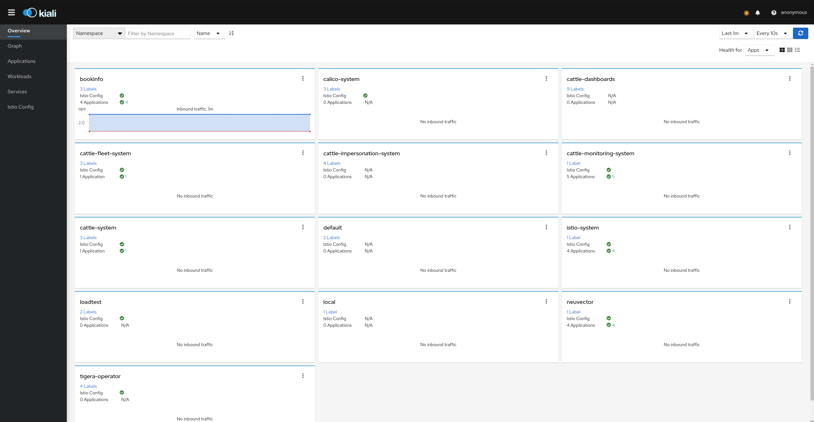
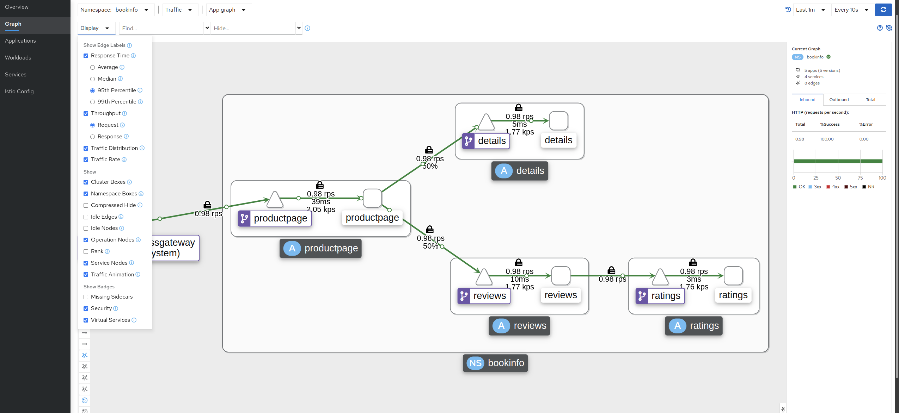
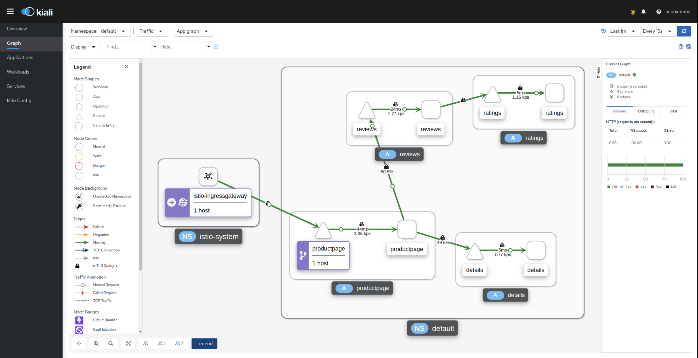
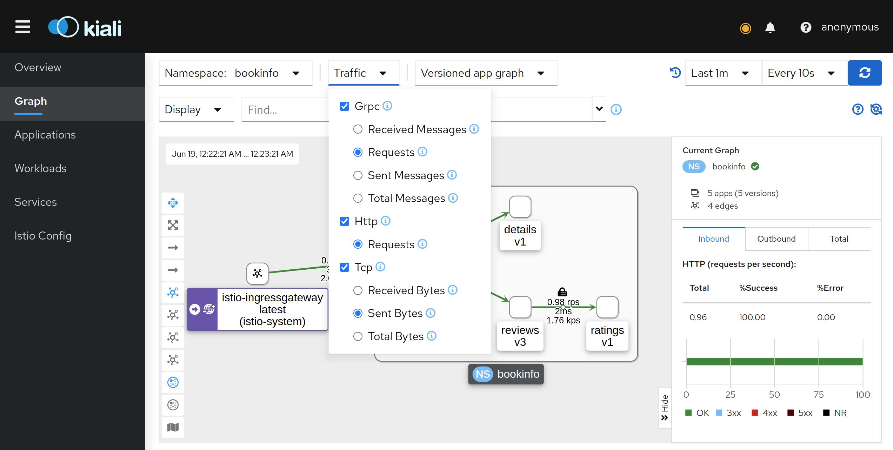
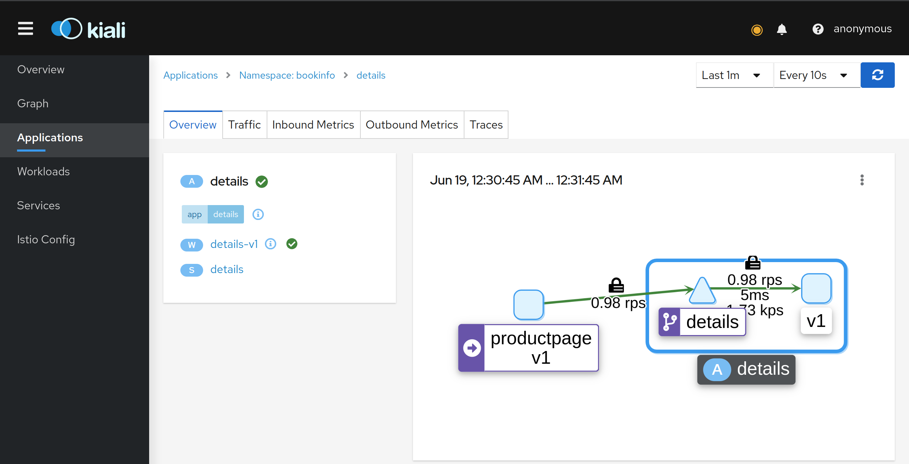
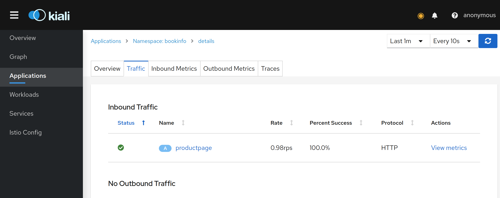
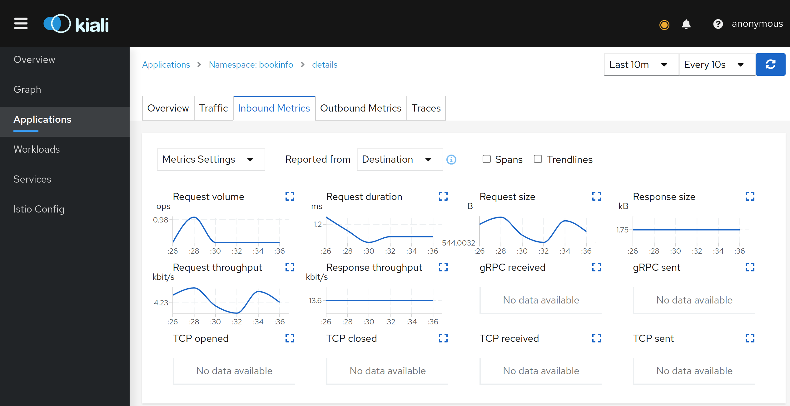
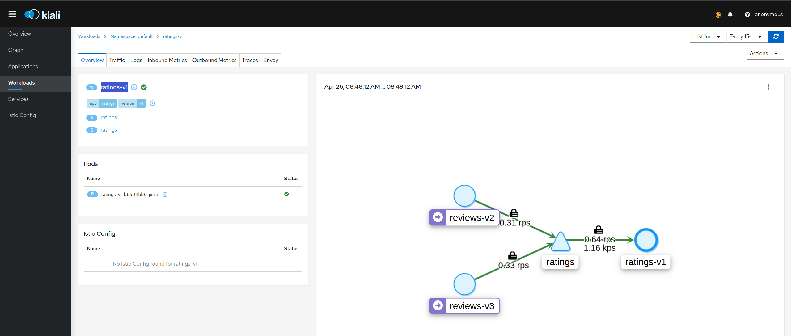

# Lab 04 - Visualize Service Mesh with Kiali

Once you have deployed the microservices app into `bookinfo` namespace and the traffic generator has been running to constantly visiting the application endpoint, we can make use of Kiali to visualize your service mesh. 

To access Kiali, 

`Cluster` > `Istio` > `Kaili`

If you have more namespace where Istio is configured, you may want to use filter & set Kiali to show particular namespace only. 

Click on `Graph`  to view the data plane Istio creates for our application. 

Click on the drop down menu for `Display` & adapt the visualization to your requirement. 

You can also check out `Istio Legends`

By taking note of the `legends`, it is easier to see how your traffic is flowing between various components.

You can also toggle between various  topologies to change the layout visualization.

Check out option in `Traffic`

Check out the option in `graph` 

You can also narrow down to view communication between 2 micro services. 

Click on `Details`  to look into details for application traffic between Productpage & Details 

Inbound traffic details for `Detail`

You can also play around with the different options on the left menu. Select `Application Page`

If you click on `productpage` under `Name` column you will see the traffic flow. 

From the left menu, select `Workload` and then under `Name` column, click on `ratings-v1`,

Similarly, from the left menu, select `Service`, and then click on `productpage` under `Name` column, you will see the Service flow. 

Finally, from the left menu, select `Istio Config` and you will see all Istio component that you can view & configure. 

To summarize, we have viewed how our application traffic is going from Istio Ingress gateway to various microservices.

