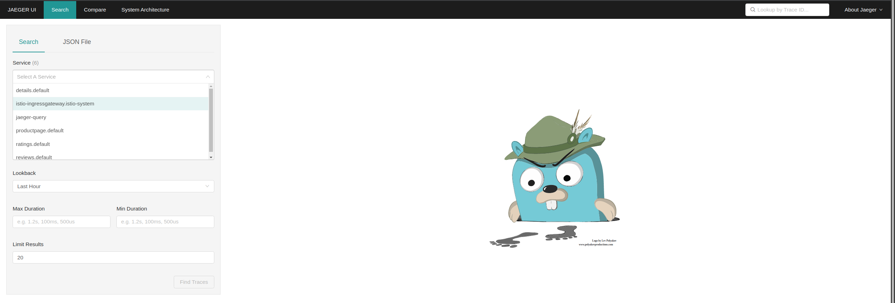
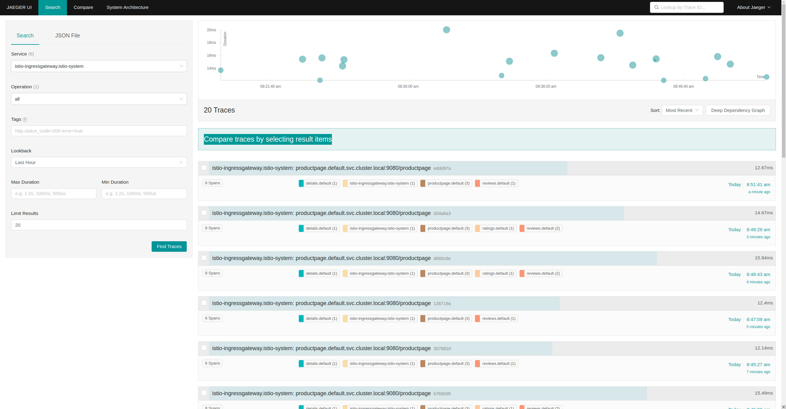
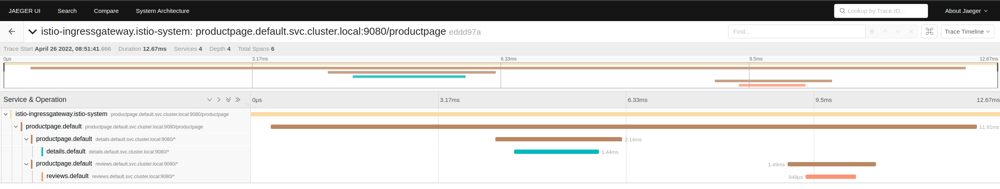
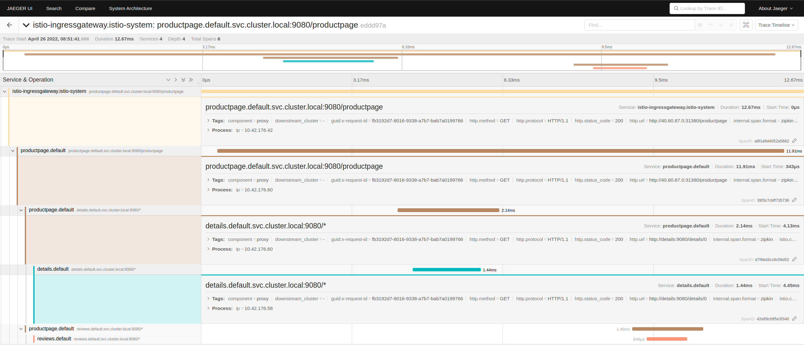
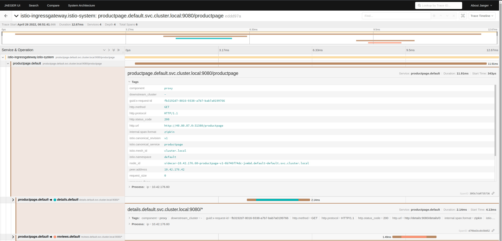
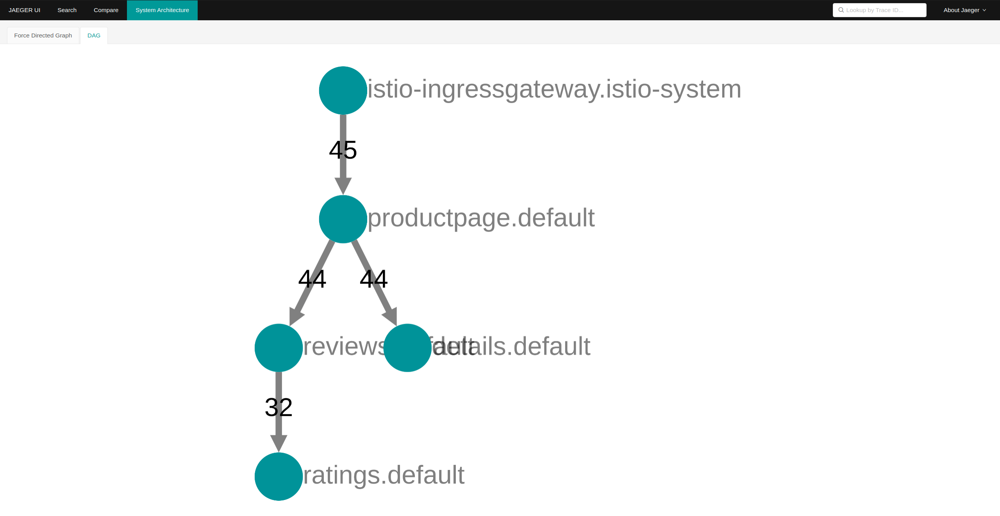

# Explore Jeager

Jaeger is used for doing distributed tracing. 

Open Jaeger UI

Search: `service` `=` `istio-ingressgateway:istio-system`

Click `Find Traces` button

Search results shows all traffic from isto-ingressgateway

Click on first results to expand 

Below results show how much time was spend at each component from the productpage. 

You can click on individual services to get additional details

 

You can further expand on individual services. Example below. 

Thus you can look into details to understand how to shorten time spend on individual service and also at component level 

You can also toggle to `system architecture` page > `dag` page to have an overview. This shows how each micro-services works.

This bring us to end of this exercise 05-Explore Jaeger. Jaeger help is distributed tracing, helps with performance & latency optimization.

In next exercise, we will take a look at SUSE's latest offering into Container Security `NeuVector`.  NeuVector provides full life-cycle container security. Click on the link to move to [Exercise-06-Explore NeuVector and how it secure micro-services](https://github.com/dsohk/rancher-istio-workshop/blob/main/docs/Exercise-06-ExploreNeuVectorandhowitsecureMicroservices.md)
