# Explore Neuvector

Access your Neuvector Server using the URL & credentials provided (over email or other communication.....).

Click on advance `Proceed to NeuvectorIP.sslip.io`

Upon clicking on proceed to Neuvector, you will routed to Neuvector Login page. Provide your Neuvector Credential. 

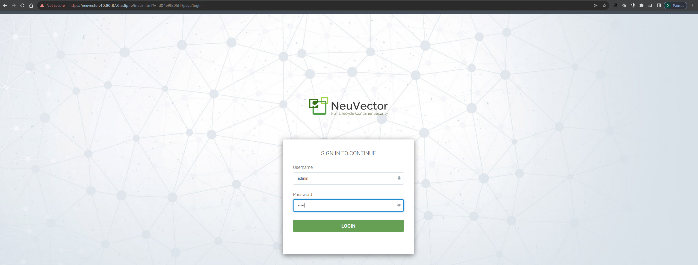

Accept the `End User License agreement` to proceed to Neuvector Homepage. 

You get a good high level overview of 

1. `Security Risk Score` for `Nodes & Pods`
2. `Service Connection Risk`. 
   - 3 different modes. 1) `Discover` , 2) `Monitor` and 3) `Protect`
3. `Ingress/Egress Exposure Risk` 
   -  3 different modes. 1) `Discover` , 2) `Monitor` and 3) `Protect`
4. `Vulnerability Exploit Risk`
   -  3 different modes. 1) `Discover` , 2) `Monitor` and 3) `Protect`

 

## Container Vulnerability Scanning

When we deploy containers, we need to make sure we have acceptable level to image vulnerability so that it can be put to production. 

`Asset`  > `Containers`  >  `Auto-Scan`

Upon turning `Auto Scan`  `= ` `on`you shall see the scan status `scheduled`

You can easily filter pod with their name to narrow you investigation. You can click on different tab such as `Compliance`, `Vulnerabilities`, `Process` and finally `Container Stats`

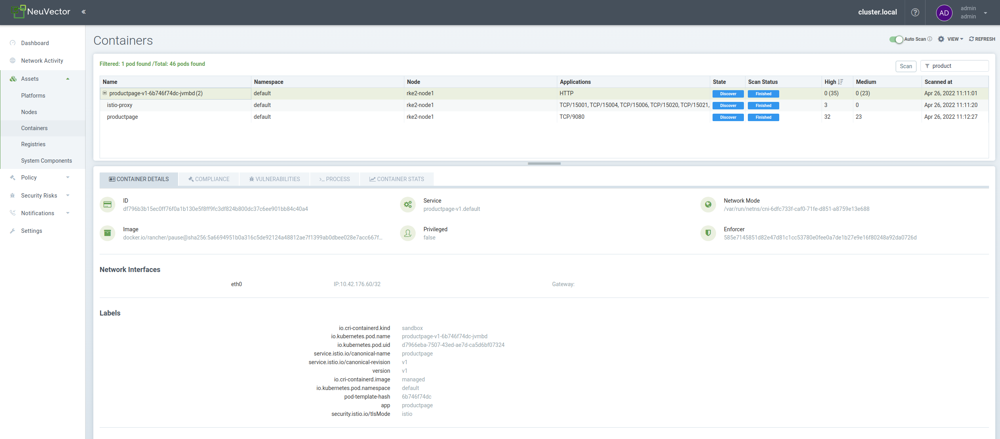

Sample of Compliance for details Containers  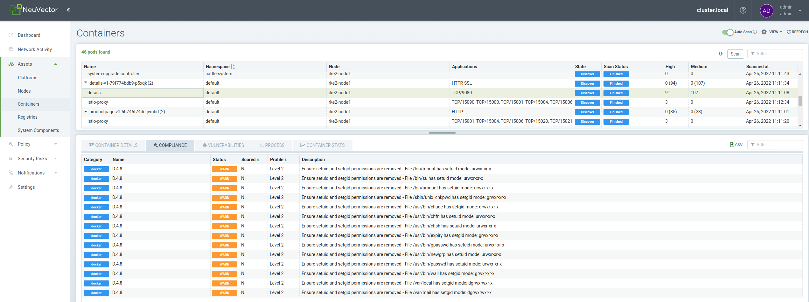

Sample Vulnerabilities for details Container

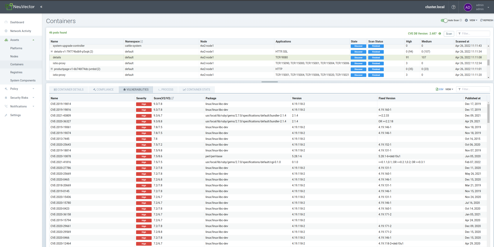

Next step we would like to understand is the Network Activity which we can learn from Neuvector.  

## Visualize Network Activity in Learning Mode

You can click on `Network Activity` tab to visualize the traffic that Neuvector has learn. 

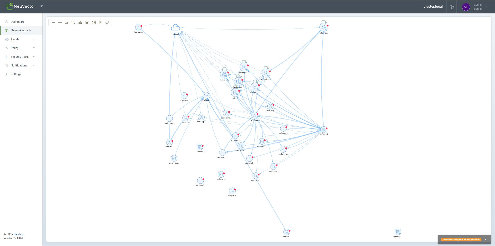

The output page is very one as you can see all pods & it's traffic both ingress & egress. 

For better visibility, let's use filter to narrow our search result 

Match Rules: default namespace only

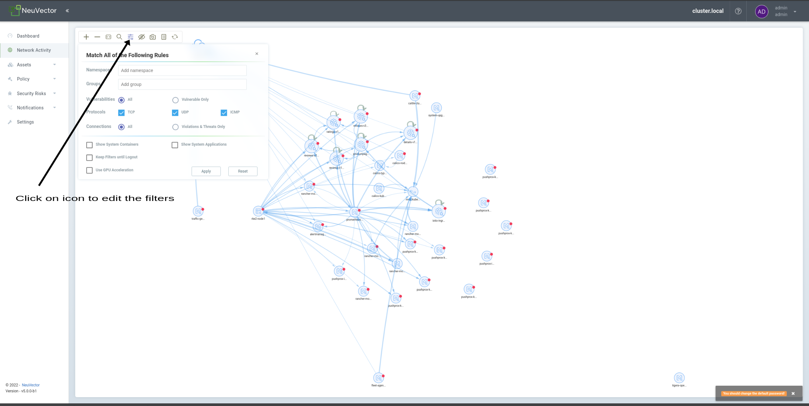

After applying the filter to the namespace we see the page less busy.

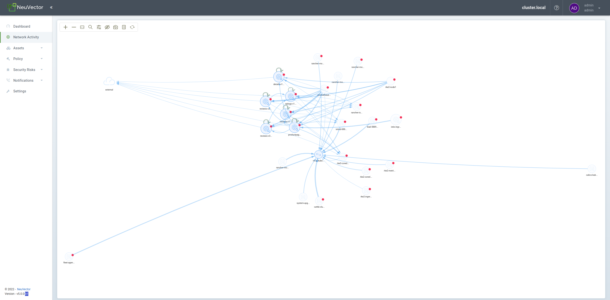

In the above filter, in the default namespace we see other pods & services like Prometheus, ClusterMetric, etc.....

We can further refine out search by hidding namespace. Let's hide below namespace 

`cattle-monitoring-system`, `cattle-fleet-system` , `cattle-system` and finally `calico-system`

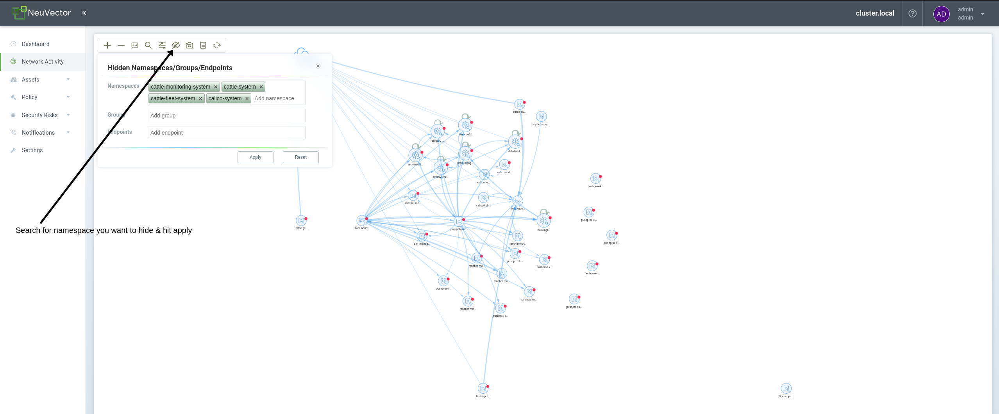

We now see things much clearer by filter to our requirement so that we can focus on area we need. 

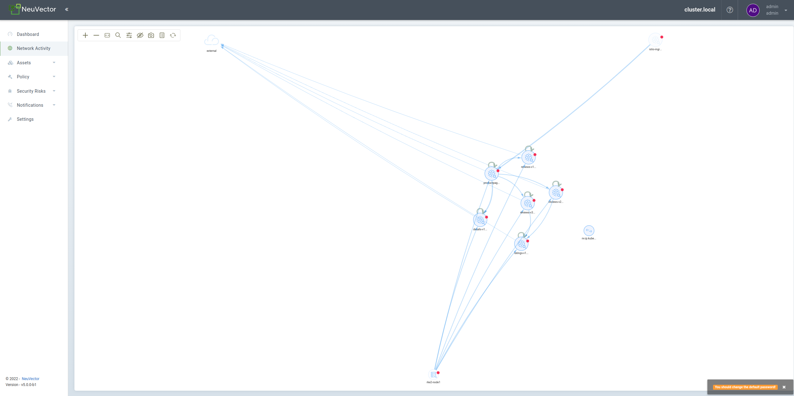

If we observe closely in the Legend for Pod, we see a red dot. If you hover you mouse around it, you will see a `High=xx, Medium=xx`. This signify the pod vunerability.

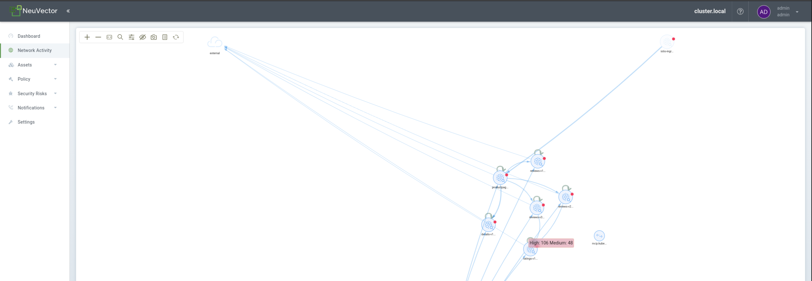

You can right click on the red dot & click on `Details`, you will get a pop out windows with few tab. 

`Pod Details`  tell you more about the pods & the vulnerabilities

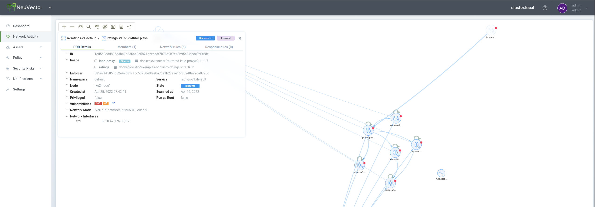

if you toggle to `Network rules` you will find the network rule Neuvector has learn when we initiated the scan/discovery. 

We see traffic arising from & use which protocol and port. You can also decide on the action associated with the communication ie. `allow` or `block`

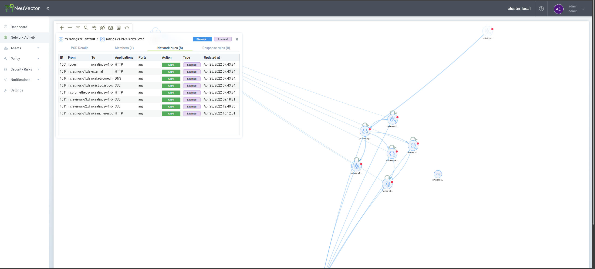

You can create quickly scan, monitor, allow or deny traffic.

You can create this rule from one cluster & import it on other cluster. You can test things in sandbox/development & then apply them to further test thing in qa to production. 

